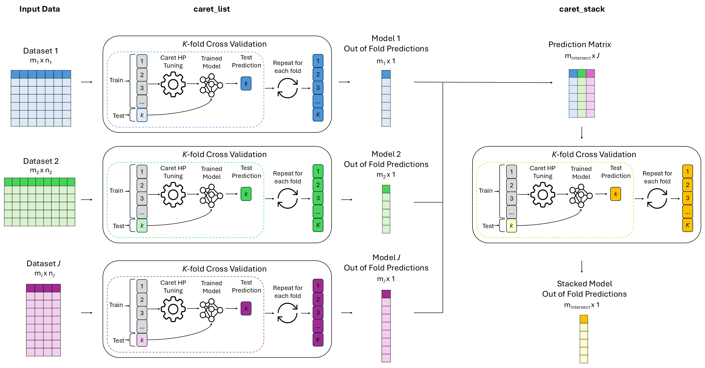

<!-- badges: start -->

[](https://app.codecov.io/gh/CompBio-Lab/caretMultimodal)
[](https://github.com/CompBio-Lab/caretMultimodal/actions/workflows/R-CMD-check.yaml)


<!-- badges: end -->

# caretMultimodal

`caretMultimodal` extends the [`caret`](https://github.com/topepo/caret) framework to support 
late fusion workflows in R, enabling users to train models independently across multiple data 
modalities and combine their predictions into a single meta-model. Designed for R developers, 
data scientists, and biomedical researchers, `caretMultimodal` makes late fusion ensemble 
modelling as accessible and flexible as single-dataset workflows in `caret`.

**Example late fusion workflow using cross-validation**



## Key Features

- Includes all the functionality of `caret`, giving users full control over sampling strategies, training methods, hyperparameter tuning, and more  
- Default cross-validation structure with careful handling to prevent data leakage across modalities  
- Late fusion ensembling using stacked generalization  
- Parallelization for faster training across models and datasets  
- Model trimming to reduce memory usage for large ensembles  
- Built-in evaluation tools for performance assessment, ROC curves, and variable importance  
- Detailed error messages to simplify debugging

## Documentation

Full API documentation is available at [compbio-lab.github.io/caretMultimodal](https://compbio-lab.github.io/caretMultimodal)

## Installation

The package can be installed using devtools

``` r
devtools::install_github("CompBio-Lab/caretMultimodal")
```

## Acknowledgements

The project structure is inspired by Zach Mayer's [caretEnsemble](https://github.com/zachmayer/caretEnsemble) package, 
which is used for stacking multiple models on a single dataset.
