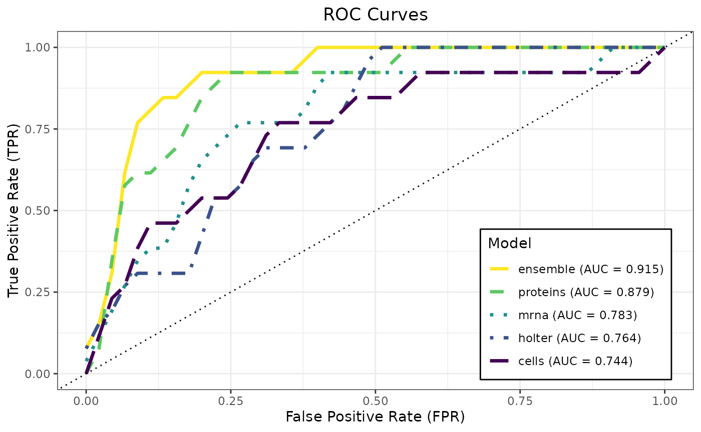
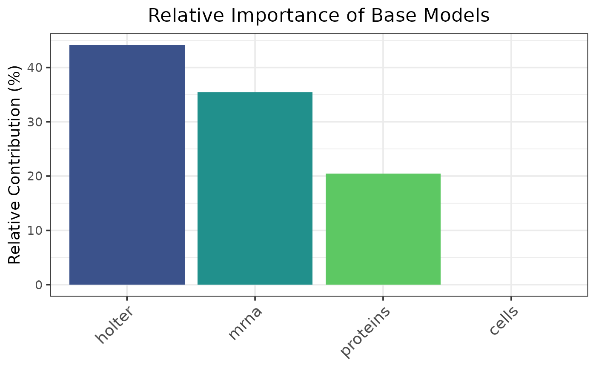
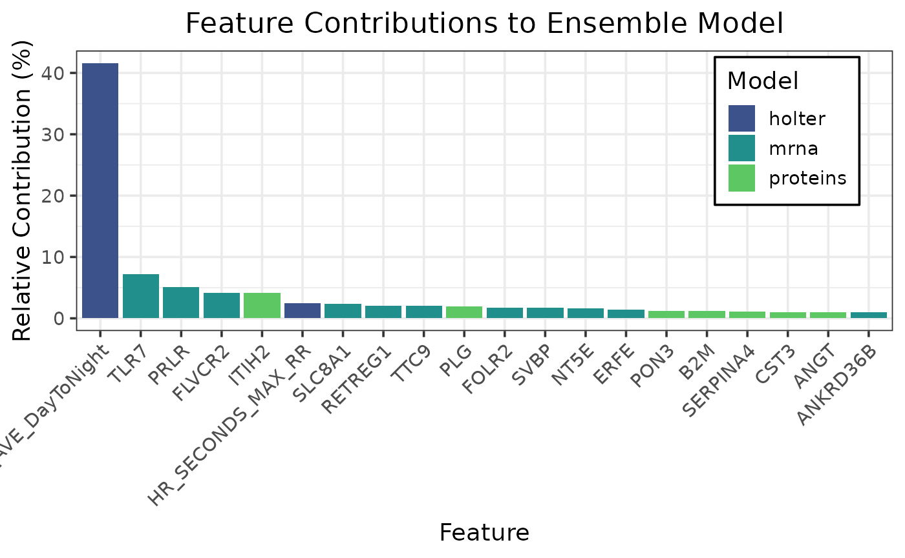
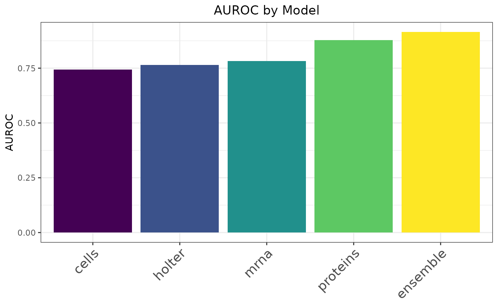
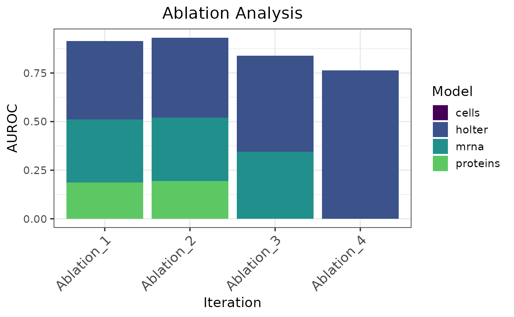

# Binary Classification Using Heart Failure Datasets

This example shows a binary classification workflow for predicting
hospitalization from multimodal heart failure data using
`caretMultimodal`. The workflow covers loading the data, training
modality-specific models and a stacked ensemble, and evaluating
performance with ROC curves, contribution plots, and ablation analysis.
The default settings on 5-fold cross validation are used to evaluate
model performance.

## Load the data

The dataset used in this example is included in the `caretMultimodal`
package.

``` r

set.seed(123L)

# Load the data
data("heart_failure_datasets", package = "caretMultimodal")

# Inspect the available modalities
vapply(heart_failure_datasets, dim, integer(2))
```

    ##      demo cells holter mrna proteins
    ## [1,]   58    58     58   58       58
    ## [2,]   29    14     29 5000       65

``` r

# Grab the target column and drop the demo dataset
hospitalizations <- heart_failure_datasets$demo$hospitalizations
heart_failure_datasets$demo <- NULL
```

## Train models with caretMultimodal

``` r

# Set up hyperparameter tuning grid
alphas <- c(0.7, 0.775, 0.850, 0.925, 1)
lambdas <- seq(0.001, 0.1, by = 0.01)
tuneGrid <- expand.grid(alpha = alphas, lambda = lambdas)

# Train the base models
heart_models <- caretMultimodal::caret_list(
  target = hospitalizations,
  data_list = heart_failure_datasets,
  method = "glmnet",
  tuneGrid = tuneGrid
)
```

    ## Loading required package: ggplot2

    ## Loading required package: lattice

    ## Warning: from glmnet C++ code (error code -94); Convergence for 94th lambda
    ## value not reached after maxit=100000 iterations; solutions for larger lambdas
    ## returned

``` r

# Train the ensemble model
heart_stack <- caretMultimodal::caret_stack(
    caret_list = heart_models,
    method = "glmnet",
    tuneGrid = tuneGrid
)
```

## Evaluate and Interpret

``` r

summary(heart_stack)
```

    ##       model method alpha lambda       ROC      Sens       Spec      ROCSD
    ##      <char> <char> <num>  <num>     <num>     <num>      <num>      <num>
    ## 1:    cells glmnet 0.850  0.091 0.7740741 0.9777778 0.00000000 0.14721931
    ## 2:   holter glmnet 0.850  0.081 0.7851852 1.0000000 0.16666667 0.08842471
    ## 3:     mrna glmnet 0.925  0.091 0.8111111 0.9777778 0.06666667 0.16789670
    ## 4: proteins glmnet 0.700  0.001 0.8962963 0.9555556 0.46666667 0.09128709
    ## 5: ensemble glmnet 0.925  0.071 0.9407407 0.9555556 0.40000000 0.06728112
    ##        SensSD    SpecSD
    ##         <num>     <num>
    ## 1: 0.04969040 0.0000000
    ## 2: 0.00000000 0.2357023
    ## 3: 0.04969040 0.1490712
    ## 4: 0.06085806 0.4472136
    ## 5: 0.09938080 0.2527625

``` r

caretMultimodal::plot_roc(heart_stack)
```



``` r

caretMultimodal::plot_model_contributions(heart_stack)
```



``` r

caretMultimodal::plot_feature_contributions(heart_stack)
```



``` r

metric_fun <- function(preds, target) {
  pROC::roc(response = target, predictor = preds, quiet = TRUE)$auc
}

caretMultimodal::plot_metric(heart_stack, metric_fun = metric_fun, metric_name = "AUROC")
```



``` r

caretMultimodal::plot_ablation(heart_stack, metric_fun = metric_fun, metric_name = "AUROC")
```


