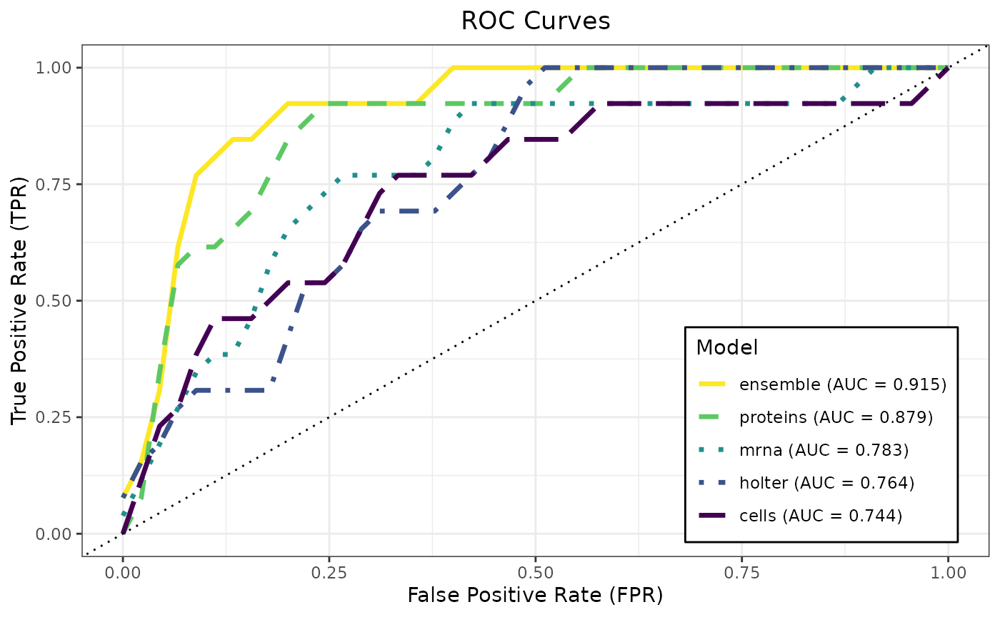
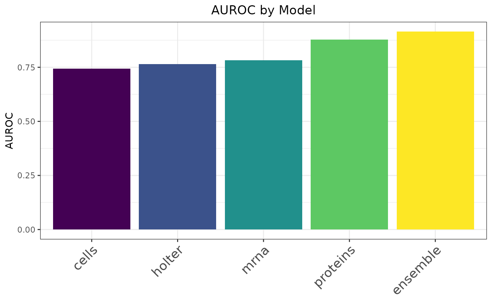
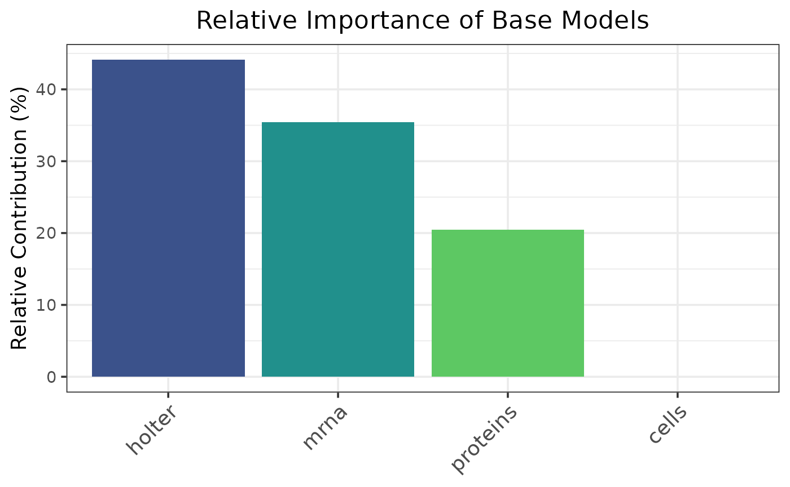
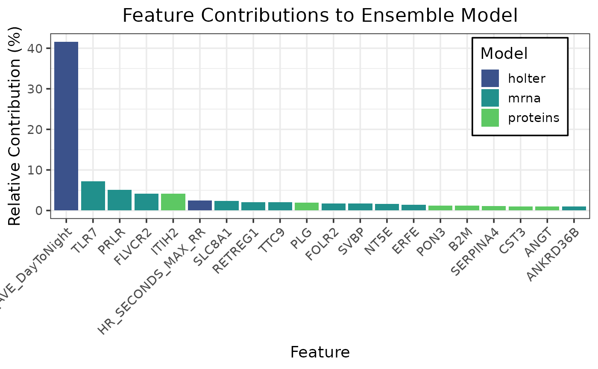
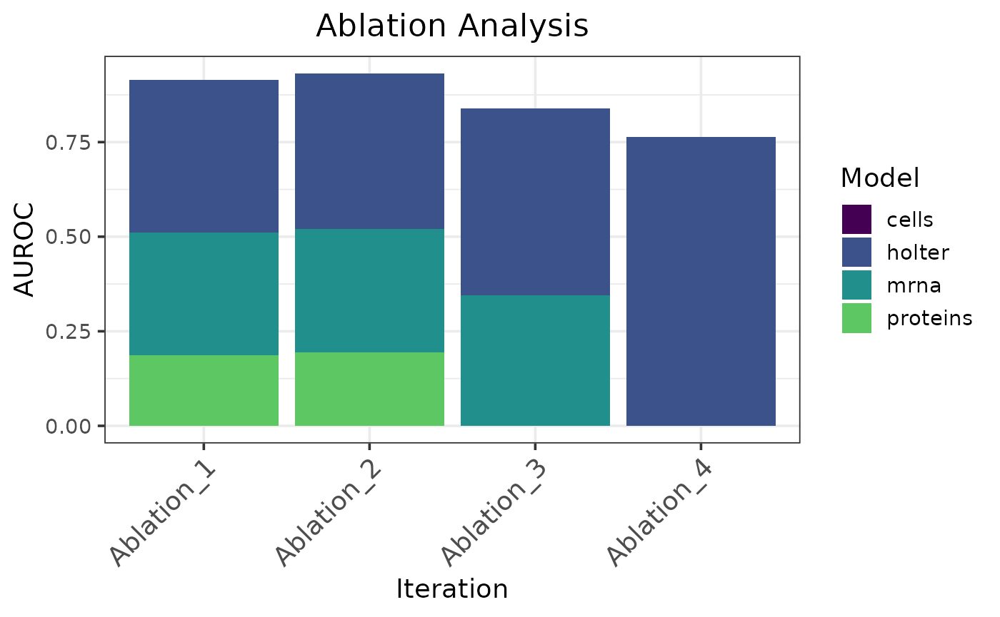
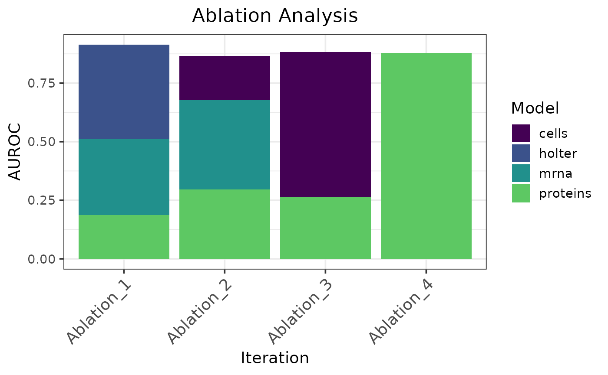

# Binary Classification Using Heart Failure Datasets

This example shows a binary classification workflow for predicting
hospitalization from multimodal heart failure data using
`caretMultimodal`. The workflow covers loading the data, training
modality-specific models and a stacked ensemble, and evaluating
performance with ROC curves, contribution plots, and ablation analysis.
The default settings on 5-fold cross validation are used to evaluate
model performance.

## Load the data

The dataset used in this example is included in the `caretMultimodal`
package.

``` r

set.seed(123L)

# Load the data
data("heart_failure_datasets", package = "caretMultimodal")

# Inspect the available modalities
vapply(heart_failure_datasets, dim, integer(2))
```

    ##      demo cells holter mrna proteins
    ## [1,]   58    58     58   58       58
    ## [2,]   29    14     29 5000       65

``` r

# Grab the target column and drop the demo dataset
hospitalizations <- heart_failure_datasets$demo$hospitalizations
heart_failure_datasets$demo <- NULL
```

## Train models with caretMultimodal

``` r

# Set up hyperparameter tuning grid
alphas <- c(0.7, 0.775, 0.850, 0.925, 1)
lambdas <- seq(0.001, 0.1, by = 0.01)
tuneGrid <- expand.grid(alpha = alphas, lambda = lambdas)

# Train the base models
heart_models <- caretMultimodal::caret_list(
  target = hospitalizations,
  data_list = heart_failure_datasets,
  method = "glmnet",
  tuneGrid = tuneGrid
)

# Train the ensemble model
heart_stack <- caretMultimodal::caret_stack(
    caret_list = heart_models,
    method = "glmnet",
    tuneGrid = tuneGrid
)
```

## Evaluate and Interpret

### Model performance

``` r

summary(heart_stack)
```

    ##       model method alpha lambda       ROC      Sens       Spec      ROCSD
    ##      <char> <char> <num>  <num>     <num>     <num>      <num>      <num>
    ## 1:    cells glmnet 0.850  0.091 0.7740741 0.9777778 0.00000000 0.14721931
    ## 2:   holter glmnet 0.850  0.081 0.7851852 1.0000000 0.16666667 0.08842471
    ## 3:     mrna glmnet 0.925  0.091 0.8111111 0.9777778 0.06666667 0.16789670
    ## 4: proteins glmnet 0.700  0.001 0.8962963 0.9555556 0.46666667 0.09128709
    ## 5: ensemble glmnet 0.925  0.071 0.9407407 0.9555556 0.40000000 0.06728112
    ##        SensSD    SpecSD
    ##         <num>     <num>
    ## 1: 0.04969040 0.0000000
    ## 2: 0.00000000 0.2357023
    ## 3: 0.04969040 0.1490712
    ## 4: 0.06085806 0.4472136
    ## 5: 0.09938080 0.2527625

**Note:** *Performance metrics returned by
[`summary.caret_stack()`](https://compbio-lab.github.io/caretMultimodal/reference/summary.caret_stack.md)
are the resampling summaries generated by `caret` and may differ from
metrics calculated directly from out-of-fold predictions. For example,
the reported ROC value is the mean ROC across resampling folds, whereas
[`plot_roc.caret_stack()`](https://compbio-lab.github.io/caretMultimodal/reference/plot_roc.caret_stack.md)
calculates AUROC from the pooled out-of-fold predictions. See
[`compute_metric.caret_stack()`](https://compbio-lab.github.io/caretMultimodal/reference/compute_metric.caret_stack.md)
for calculating metrics directly from pooled out-of-fold predictions.*

``` r

# plot_roc is only for binary classification
caretMultimodal::plot_roc(heart_stack)
```



``` r

metric_fun <- function(preds, target) {
  pROC::roc(response = target, predictor = preds, quiet = TRUE)$auc
}

caretMultimodal::compute_metric(
  heart_stack, 
  metric_fun = metric_fun, 
  metric_name = "AUROC"
)
```

    ##       Model     AUROC
    ##      <char>     <num>
    ## 1:    cells 0.7435897
    ## 2:   holter 0.7641026
    ## 3:     mrna 0.7829060
    ## 4: proteins 0.8786325
    ## 5: ensemble 0.9145299

``` r

caretMultimodal::plot_metric(
  heart_stack, 
  metric_fun = metric_fun, 
  metric_name = "AUROC"
)
```



### Base model and feature contributions

``` r

caretMultimodal::compute_model_contributions(heart_stack)
```

    ##       Model Relative Contribution
    ##      <char>                 <num>
    ## 1:   holter               44.1023
    ## 2:     mrna               35.3940
    ## 3: proteins               20.5037
    ## 4:    cells                0.0000

``` r

caretMultimodal::plot_model_contributions(heart_stack)
```



``` r

caretMultimodal::compute_feature_contributions(heart_stack)
```

    ##        Model              Feature Relative Contribution
    ##       <char>               <char>                 <num>
    ##  1:   holter HS_HR_AVE_DayToNight             41.585315
    ##  2:     mrna                 TLR7              7.210145
    ##  3:     mrna                 PRLR              5.048845
    ##  4:     mrna               FLVCR2              4.168204
    ##  5: proteins                ITIH2              4.114475
    ##  6:   holter    HR_SECONDS_MAX_RR              2.516984
    ##  7:     mrna               SLC8A1              2.398912
    ##  8:     mrna              RETREG1              2.088714
    ##  9:     mrna                 TTC9              2.064062
    ## 10: proteins                  PLG              1.965363
    ## 11:     mrna                FOLR2              1.749651
    ## 12:     mrna                 SVBP              1.738274
    ## 13:     mrna                 NT5E              1.614556
    ## 14:     mrna                 ERFE              1.390788
    ## 15: proteins                 PON3              1.248055
    ## 16: proteins                  B2M              1.200775
    ## 17: proteins             SERPINA4              1.065383
    ## 18: proteins                 CST3              1.047414
    ## 19: proteins                 ANGT              1.039845
    ## 20:     mrna             ANKRD36B              1.029405
    ##        Model              Feature Relative Contribution
    ##       <char>               <char>                 <num>

``` r

caretMultimodal::plot_feature_contributions(heart_stack)
```



### Ablation analysis

``` r

# Forward ablation
caretMultimodal::compute_ablation(
  heart_stack, 
  metric_fun = metric_fun, 
  metric_name = "AUROC"
)
```

    ##         Row Ablation_1 Ablation_2 Ablation_3  Ablation_4
    ##      <char>      <num>      <num>      <num>       <num>
    ## 1:    cells  0.0000000         NA         NA          NA
    ## 2:   holter 44.1022985 44.0964872 58.8999619 100.0000000
    ## 3:     mrna 35.3940024 35.0032406 41.1000381          NA
    ## 4: proteins 20.5036991 20.9002722         NA          NA
    ## 5:    AUROC  0.9145299  0.9316239  0.8393162   0.7641026

``` r

caretMultimodal::plot_ablation(
  heart_stack, 
  metric_fun = metric_fun, 
  metric_name = "AUROC"
)
```



``` r

# Reverse ablation
caretMultimodal::compute_ablation(
  heart_stack, 
  metric_fun = metric_fun, 
  metric_name = "AUROC", 
  reverse = TRUE
)
```

    ##         Row Ablation_1 Ablation_2 Ablation_3  Ablation_4
    ##      <char>      <num>      <num>      <num>       <num>
    ## 1:    cells  0.0000000 21.8906212 70.2577439          NA
    ## 2:   holter 44.1022985         NA         NA          NA
    ## 3:     mrna 35.3940024 43.9049679         NA          NA
    ## 4: proteins 20.5036991 34.2044109 29.7422561 100.0000000
    ## 5:    AUROC  0.9145299  0.8666667  0.8820513   0.8786325

``` r

caretMultimodal::plot_ablation(
  heart_stack, 
  metric_fun = metric_fun, 
  metric_name = "AUROC", 
  reverse = TRUE
)
```


