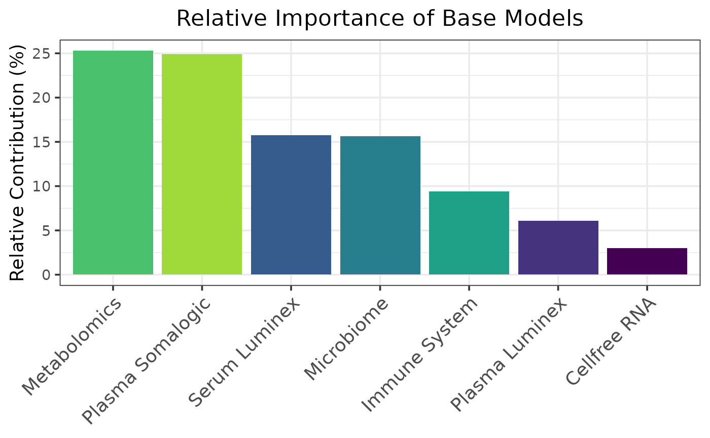
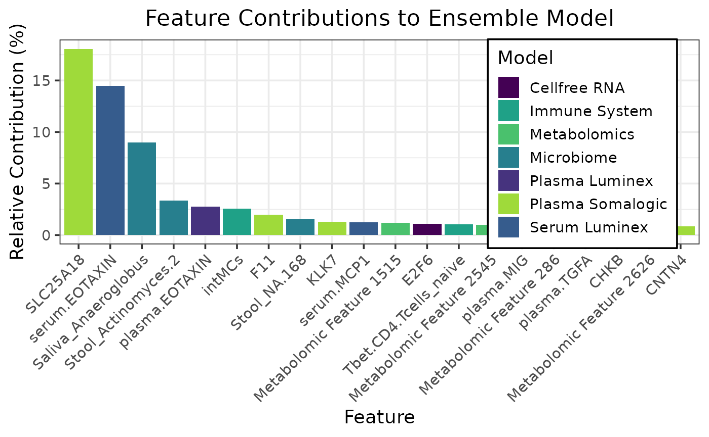
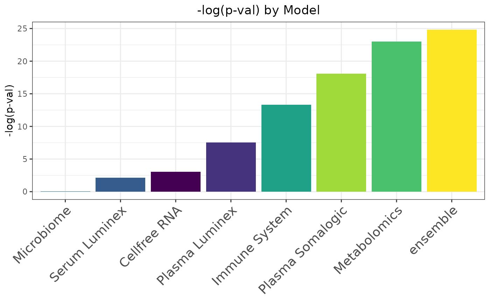
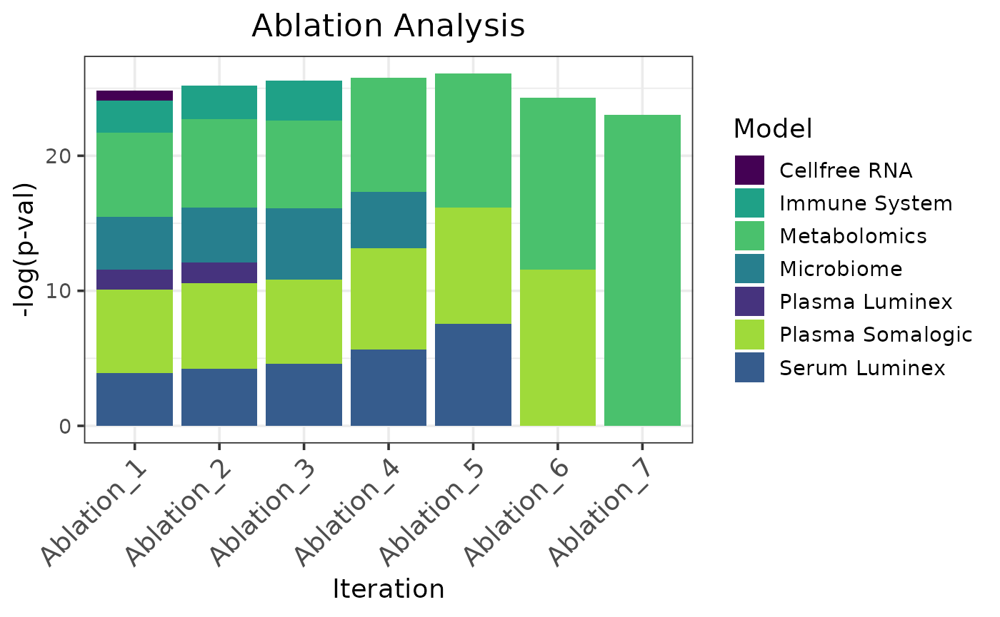

# Regression Using Pregnancy Datasets

This example shows a regression workflow for predicting gestational age
from multimodal pregnancy data using caretMultimodal. The workflow
covers downloading and preprocessing seven paired omics assays, training
modality-specific elastic net models and a stacked ensemble under
leave-one-subject-out cross-validation, and evaluating performance with
Spearman correlation, contribution plots, and ablation analysis.

## Load and preprocess the data

``` r

# Download the data
url <- "https://nalab.stanford.edu/wp-content/uploads/termpregnancymultiomics.zip"
buf <- curl::curl_fetch_memory(url)$content
load(archive::archive_read(rawConnection(buf), file = "termpregnancymultiomics/Data.Rda"))

# Name the input data
names(InputData) <- c("Cellfree RNA", "Plasma Luminex", "Serum Luminex", "Microbiome", "Immune System", "Metabolomics", "Plasma Somalogic")

# Correct nonstandard feature names
InputData <- lapply(InputData, function(df) {
  df <- as.data.frame(df)
  names(df) <- make.names(iconv(names(df), from = "latin1", to = "UTF-8", sub = ""), unique = TRUE)
  df
})

names(InputData$Metabolomics) <- paste("Metabolomic Feature", seq_along(names(InputData$Metabolomics)))

# Remove postpartum samples
postpartum_indices <- which(featureweeks < 0)
InputData <- lapply(InputData, function(x) x[-postpartum_indices, ])
featurepatients <- featurepatients[-postpartum_indices]
featureweeks <- featureweeks[-postpartum_indices]
```

## Train models with caretMultimodal

``` r

set.seed(42L)

# Define hyperparameter tuning grid
alphas <- seq(0, 1, 0.1)
lambdas <- seq(0, 12, by = 0.5)
tuneGrid <- expand.grid(alpha = alphas, lambda = lambdas)

# Set up leave-one-subject out cross validation
loso_folds <- lapply(unique(featurepatients), function(p) {
  which(featurepatients != p)  # indices of all samples NOT in this patient
})
 
trControl <- caret::trainControl(
  method = "cv",
  index = loso_folds,
  savePredictions = "final",
  summaryFunction = caret::defaultSummary
)
 
# Train the base models
pregnancy_models <- caretMultimodal::caret_list(
  data_list = InputData,
  target = featureweeks,
  method = "glmnet",
  tuneGrid = tuneGrid,
  trControl = trControl,
  trim = FALSE
)
```

    ## Loading required package: ggplot2

    ## Loading required package: lattice

    ## Warning in nominalTrainWorkflow(x = x, y = y, wts = weights, info = trainInfo,
    ## : There were missing values in resampled performance measures.
    ## Warning in nominalTrainWorkflow(x = x, y = y, wts = weights, info = trainInfo,
    ## : There were missing values in resampled performance measures.
    ## Warning in nominalTrainWorkflow(x = x, y = y, wts = weights, info = trainInfo,
    ## : There were missing values in resampled performance measures.
    ## Warning in nominalTrainWorkflow(x = x, y = y, wts = weights, info = trainInfo,
    ## : There were missing values in resampled performance measures.
    ## Warning in nominalTrainWorkflow(x = x, y = y, wts = weights, info = trainInfo,
    ## : There were missing values in resampled performance measures.
    ## Warning in nominalTrainWorkflow(x = x, y = y, wts = weights, info = trainInfo,
    ## : There were missing values in resampled performance measures.
    ## Warning in nominalTrainWorkflow(x = x, y = y, wts = weights, info = trainInfo,
    ## : There were missing values in resampled performance measures.

``` r

# Train the ensemble model
pregnancy_stack <- caretMultimodal::caret_stack(
  pregnancy_models,
  method = "glmnet",
  tuneGrid = tuneGrid,
  trControl = trControl
)
```

    ## Warning in nominalTrainWorkflow(x = x, y = y, wts = weights, info = trainInfo,
    ## : There were missing values in resampled performance measures.

## Evaluate and Interpret

``` r

summary(pregnancy_stack)
```

    ##               model method alpha lambda     RMSE  Rsquared      MAE   RMSESD
    ##              <char> <char> <num>  <num>    <num>     <num>    <num>    <num>
    ## 1:     Cellfree RNA glmnet   0.5    4.5 7.514323 0.6728265 6.094657 2.316190
    ## 2:   Plasma Luminex glmnet   0.7    1.0 6.264192 0.7268943 5.029513 1.921326
    ## 3:    Serum Luminex glmnet   1.0    2.0 7.988148 0.6981922 6.677682 1.668235
    ## 4:       Microbiome glmnet   0.2   11.5 8.130642 0.4181656 6.648128 1.991066
    ## 5:    Immune System glmnet   0.1    1.5 4.559213 0.9013736 3.970832 1.973698
    ## 6:     Metabolomics glmnet   0.1    0.5 2.965703 0.9640824 2.513691 1.675753
    ## 7: Plasma Somalogic glmnet   1.0    1.0 3.444065 0.8865887 2.659584 2.118518
    ## 8:         ensemble glmnet   0.0    0.5 2.758618 0.9772290 2.305836 1.388231
    ##    RsquaredSD    MAESD
    ##         <num>    <num>
    ## 1: 0.28378405 1.820931
    ## 2: 0.30932681 1.738192
    ## 3: 0.27331008 1.482994
    ## 4: 0.31921014 1.713364
    ## 5: 0.23586666 1.745224
    ## 6: 0.04075627 1.390273
    ## 7: 0.24339738 1.232796
    ## 8: 0.02707345 1.176519

``` r

caretMultimodal::plot_model_contributions(pregnancy_stack)
```



``` r

caretMultimodal::plot_feature_contributions(pregnancy_stack)
```



``` r

metric_fun <- function(preds, target) {
  -log10(cor.test(preds, target, method = "spearman")$p.value)
}

caretMultimodal::plot_metric(pregnancy_stack, metric_fun = metric_fun, metric_name = "-log(p-val)")
```



``` r

caretMultimodal::plot_ablation(pregnancy_stack, metric_fun = metric_fun, metric_name = "-log(p-val)")
```

    ## Warning in nominalTrainWorkflow(x = x, y = y, wts = weights, info = trainInfo,
    ## : There were missing values in resampled performance measures.

    ## Warning in cor.test.default(preds, target, method = "spearman"): cannot compute
    ## exact p-value with ties

    ## Warning in nominalTrainWorkflow(x = x, y = y, wts = weights, info = trainInfo,
    ## : There were missing values in resampled performance measures.

    ## Warning in cor.test.default(preds, target, method = "spearman"): cannot compute
    ## exact p-value with ties

    ## Warning in nominalTrainWorkflow(x = x, y = y, wts = weights, info = trainInfo,
    ## : There were missing values in resampled performance measures.

    ## Warning in cor.test.default(preds, target, method = "spearman"): cannot compute
    ## exact p-value with ties

    ## Warning in nominalTrainWorkflow(x = x, y = y, wts = weights, info = trainInfo,
    ## : There were missing values in resampled performance measures.

    ## Warning in cor.test.default(preds, target, method = "spearman"): cannot compute
    ## exact p-value with ties

    ## Warning in nominalTrainWorkflow(x = x, y = y, wts = weights, info = trainInfo,
    ## : There were missing values in resampled performance measures.

    ## Warning in cor.test.default(preds, target, method = "spearman"): cannot compute
    ## exact p-value with ties

    ## Warning in nominalTrainWorkflow(x = x, y = y, wts = weights, info = trainInfo,
    ## : There were missing values in resampled performance measures.

    ## Warning in cor.test.default(preds, target, method = "spearman"): cannot compute
    ## exact p-value with ties
    ## Warning in cor.test.default(preds, target, method = "spearman"): cannot compute
    ## exact p-value with ties


