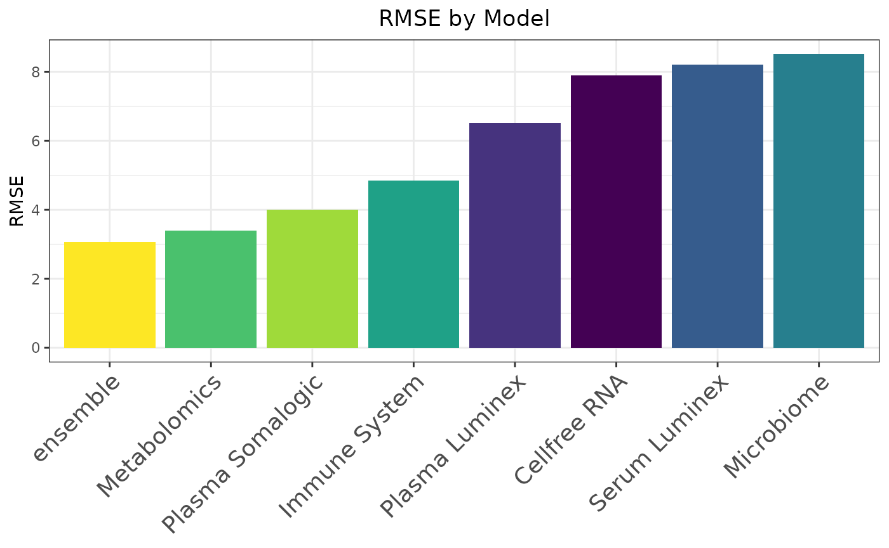
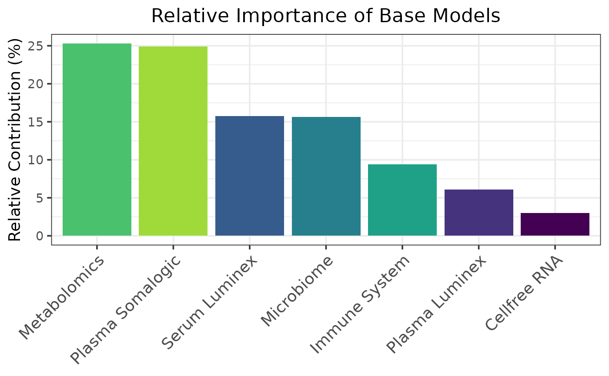
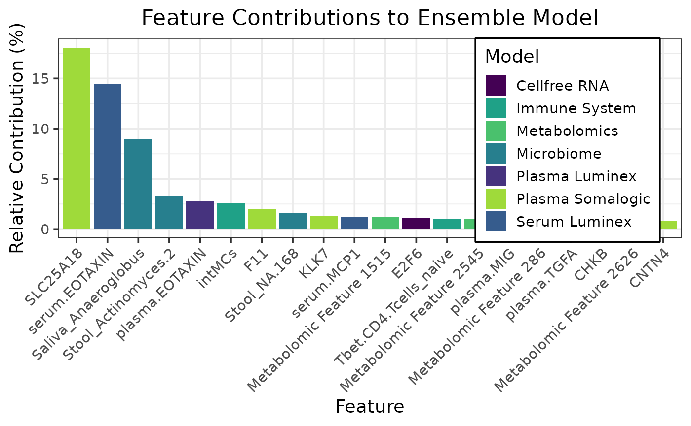
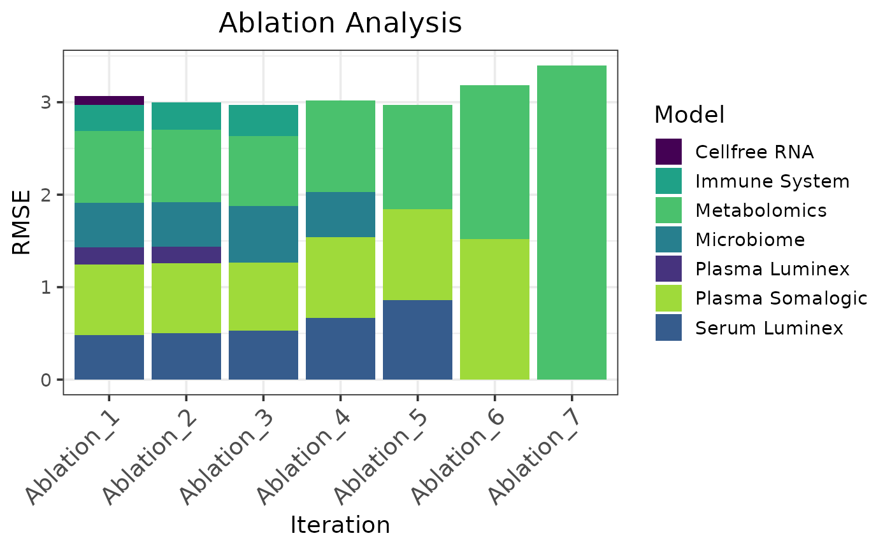
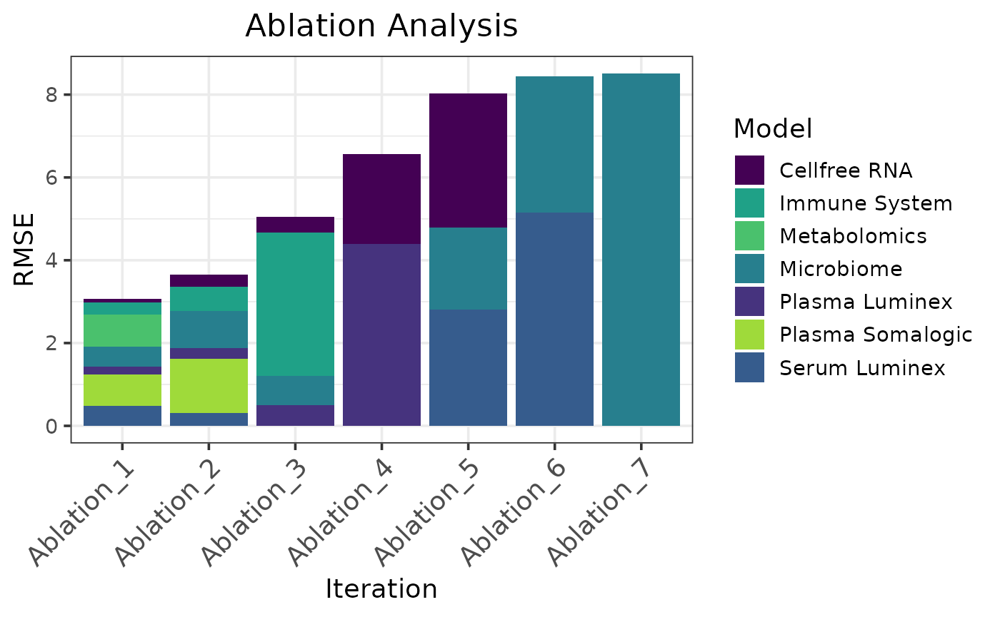

# Regression Using Pregnancy Datasets

This example shows a regression workflow for predicting gestational age
from multimodal pregnancy data using caretMultimodal. The workflow
covers downloading and preprocessing seven paired omics assays, training
modality-specific elastic net models and a stacked ensemble under
leave-one-subject-out cross-validation, and evaluating performance with
Spearman correlation, contribution plots, and ablation analysis.

## Load and preprocess the data

``` r

# Download the data
url <- "https://nalab.stanford.edu/wp-content/uploads/termpregnancymultiomics.zip"
buf <- curl::curl_fetch_memory(url)$content
load(archive::archive_read(rawConnection(buf), file = "termpregnancymultiomics/Data.Rda"))

# Name the input data
names(InputData) <- c("Cellfree RNA", "Plasma Luminex", "Serum Luminex", "Microbiome", "Immune System", "Metabolomics", "Plasma Somalogic")

# Correct nonstandard feature names
InputData <- lapply(InputData, function(df) {
  df <- as.data.frame(df)
  names(df) <- make.names(iconv(names(df), from = "latin1", to = "UTF-8", sub = ""), unique = TRUE)
  df
})

names(InputData$Metabolomics) <- paste("Metabolomic Feature", seq_along(names(InputData$Metabolomics)))

# Remove postpartum samples
postpartum_indices <- which(featureweeks < 0)
InputData <- lapply(InputData, function(x) x[-postpartum_indices, ])
featurepatients <- featurepatients[-postpartum_indices]
featureweeks <- featureweeks[-postpartum_indices]
```

## Train models with caretMultimodal

``` r

set.seed(42L)

# Define hyperparameter tuning grid
alphas <- seq(0, 1, 0.1)
lambdas <- seq(0, 12, by = 0.5)
tuneGrid <- expand.grid(alpha = alphas, lambda = lambdas)

# Set up leave-one-subject out cross validation
loso_folds <- lapply(unique(featurepatients), function(p) {
  which(featurepatients != p)  # indices of all samples NOT in this patient
})
 
trControl <- caret::trainControl(
  method = "cv",
  index = loso_folds,
  savePredictions = "final",
  summaryFunction = caret::defaultSummary
)
 
# Train the base models
pregnancy_models <- caretMultimodal::caret_list(
  data_list = InputData,
  target = featureweeks,
  method = "glmnet",
  tuneGrid = tuneGrid,
  trControl = trControl,
  trim = FALSE
)
 
# Train the ensemble model
pregnancy_stack <- caretMultimodal::caret_stack(
  pregnancy_models,
  method = "glmnet",
  tuneGrid = tuneGrid,
  trControl = trControl
)
```

## Evaluate and Interpret

### Model performance

``` r

summary(pregnancy_stack)
```

    ##               model method alpha lambda     RMSE  Rsquared      MAE   RMSESD
    ##              <char> <char> <num>  <num>    <num>     <num>    <num>    <num>
    ## 1:     Cellfree RNA glmnet   0.5    4.5 7.514323 0.6728265 6.094657 2.316190
    ## 2:   Plasma Luminex glmnet   0.7    1.0 6.264192 0.7268943 5.029513 1.921326
    ## 3:    Serum Luminex glmnet   1.0    2.0 7.988148 0.6981922 6.677682 1.668235
    ## 4:       Microbiome glmnet   0.2   11.5 8.130642 0.4181656 6.648128 1.991066
    ## 5:    Immune System glmnet   0.1    1.5 4.559213 0.9013736 3.970832 1.973698
    ## 6:     Metabolomics glmnet   0.1    0.5 2.965703 0.9640824 2.513691 1.675753
    ## 7: Plasma Somalogic glmnet   1.0    1.0 3.444065 0.8865887 2.659584 2.118518
    ## 8:         ensemble glmnet   0.0    0.5 2.758618 0.9772290 2.305836 1.388231
    ##    RsquaredSD    MAESD
    ##         <num>    <num>
    ## 1: 0.28378405 1.820931
    ## 2: 0.30932681 1.738192
    ## 3: 0.27331008 1.482994
    ## 4: 0.31921014 1.713364
    ## 5: 0.23586666 1.745224
    ## 6: 0.04075627 1.390273
    ## 7: 0.24339738 1.232796
    ## 8: 0.02707345 1.176519

**Note:** *Performance metrics returned by
[`summary.caret_stack()`](https://compbio-lab.github.io/caretMultimodal/reference/summary.caret_stack.md)
are the resampling summaries generated by `caret` and may differ from
metrics calculated from pooled out-of-fold predictions. See
[`compute_metric.caret_stack()`](https://compbio-lab.github.io/caretMultimodal/reference/compute_metric.caret_stack.md)
for calculating metrics directly from pooled out-of-fold predictions.*

``` r

metric_fun <- function(preds, target) {
  sqrt(mean((preds - target)^2))
}

caretMultimodal::compute_metric(
  pregnancy_stack,
  metric_fun = metric_fun,
  metric_name = "RMSE"
)
```

    ##               Model     RMSE
    ##              <char>    <num>
    ## 1:         ensemble 3.065251
    ## 2:     Metabolomics 3.397811
    ## 3: Plasma Somalogic 4.001478
    ## 4:    Immune System 4.856087
    ## 5:   Plasma Luminex 6.516770
    ## 6:     Cellfree RNA 7.891113
    ## 7:    Serum Luminex 8.210961
    ## 8:       Microbiome 8.512699

``` r

caretMultimodal::plot_metric(
  pregnancy_stack,
  metric_fun = metric_fun,
  metric_name = "RMSE"
)
```



### Base model and feature contributions

``` r

caretMultimodal::compute_model_contributions(pregnancy_stack)
```

    ##               Model Relative Contribution
    ##              <char>                 <num>
    ## 1:     Metabolomics             25.285246
    ## 2: Plasma Somalogic             24.874757
    ## 3:    Serum Luminex             15.742591
    ## 4:       Microbiome             15.616400
    ## 5:    Immune System              9.385203
    ## 6:   Plasma Luminex              6.109482
    ## 7:     Cellfree RNA              2.986322

``` r

caretMultimodal::plot_model_contributions(pregnancy_stack)
```



``` r

caretMultimodal::compute_feature_contributions(pregnancy_stack)
```

    ##                Model                  Feature Relative Contribution
    ##               <char>                   <char>                 <num>
    ##  1: Plasma Somalogic                 SLC25A18            18.0723947
    ##  2:    Serum Luminex            serum.EOTAXIN            14.4946102
    ##  3:       Microbiome      Saliva_Anaeroglobus             9.0073678
    ##  4:       Microbiome      Stool_Actinomyces.2             3.3268629
    ##  5:   Plasma Luminex           plasma.EOTAXIN             2.7806292
    ##  6:    Immune System                   intMCs             2.5522895
    ##  7: Plasma Somalogic                      F11             1.9678954
    ##  8:       Microbiome             Stool_NA.168             1.5943148
    ##  9: Plasma Somalogic                     KLK7             1.2901194
    ## 10:    Serum Luminex               serum.MCP1             1.2479806
    ## 11:     Metabolomics Metabolomic Feature 1515             1.1777251
    ## 12:     Cellfree RNA                     E2F6             1.0780740
    ## 13:    Immune System    Tbet.CD4.Tcells_naive             1.0451590
    ## 14:     Metabolomics Metabolomic Feature 2545             0.9796715
    ## 15:   Plasma Luminex               plasma.MIG             0.9552108
    ## 16:     Metabolomics  Metabolomic Feature 286             0.9410198
    ## 17:   Plasma Luminex              plasma.TGFA             0.9403460
    ## 18: Plasma Somalogic                     CHKB             0.9087291
    ## 19:     Metabolomics Metabolomic Feature 2626             0.8667525
    ## 20: Plasma Somalogic                    CNTN4             0.8663147
    ##                Model                  Feature Relative Contribution
    ##               <char>                   <char>                 <num>

``` r

caretMultimodal::plot_feature_contributions(pregnancy_stack)
```



### Ablation analysis

``` r

# Forward ablation
caretMultimodal::compute_ablation(
  pregnancy_stack, 
  metric_fun = metric_fun, 
  metric_name = "RMSE"
)
```

    ##                 Row Ablation_1 Ablation_2 Ablation_3 Ablation_4 Ablation_5
    ##              <char>      <num>      <num>      <num>      <num>      <num>
    ## 1:     Cellfree RNA   2.986322         NA         NA         NA         NA
    ## 2:   Plasma Luminex   6.109482   6.001124         NA         NA         NA
    ## 3:    Serum Luminex  15.742591  16.698123  17.887264  22.000382  28.973279
    ## 4:       Microbiome  15.616400  16.130522  20.676324  16.183171         NA
    ## 5:    Immune System   9.385203   9.842819  11.468707         NA         NA
    ## 6:     Metabolomics  25.285246  26.126223  25.407053  32.831343  37.965888
    ## 7: Plasma Somalogic  24.874757  25.201190  24.560652  28.985104  33.060834
    ## 8:             RMSE   3.065251   2.996606   2.974001   3.017194   2.973132
    ##    Ablation_6 Ablation_7
    ##         <num>      <num>
    ## 1:         NA         NA
    ## 2:         NA         NA
    ## 3:         NA         NA
    ## 4:         NA         NA
    ## 5:         NA         NA
    ## 6:  52.323708 100.000000
    ## 7:  47.676292         NA
    ## 8:   3.184959   3.397811

``` r

caretMultimodal::plot_ablation(
  pregnancy_stack, 
  metric_fun = metric_fun, 
  metric_name = "RMSE"
)
```



``` r

# Reverse ablation
caretMultimodal::compute_ablation(
  pregnancy_stack, 
  metric_fun = metric_fun, 
  metric_name = "RMSE", 
  reverse = TRUE
)
```

    ##                 Row Ablation_1 Ablation_2 Ablation_3 Ablation_4 Ablation_5
    ##              <char>      <num>      <num>      <num>      <num>      <num>
    ## 1:     Cellfree RNA   2.986322   8.181560   7.695312  33.165760  40.263147
    ## 2:   Plasma Luminex   6.109482   7.077252  10.012191  66.834240         NA
    ## 3:    Serum Luminex  15.742591   8.352738   0.000000   0.000000  35.039780
    ## 4:       Microbiome  15.616400  24.712844  14.023535   0.000000  24.697073
    ## 5:    Immune System   9.385203  15.843630  68.268962         NA         NA
    ## 6:     Metabolomics  25.285246         NA         NA         NA         NA
    ## 7: Plasma Somalogic  24.874757  35.831976         NA         NA         NA
    ## 8:             RMSE   3.065251   3.658108   5.053631   6.563378   8.024488
    ##    Ablation_6 Ablation_7
    ##         <num>      <num>
    ## 1:         NA         NA
    ## 2:         NA         NA
    ## 3:  60.882182         NA
    ## 4:  39.117818 100.000000
    ## 5:         NA         NA
    ## 6:         NA         NA
    ## 7:         NA         NA
    ## 8:   8.448777   8.512699

``` r

caretMultimodal::plot_ablation(
  pregnancy_stack, 
  metric_fun = metric_fun, 
  metric_name = "RMSE", 
  reverse = TRUE
)
```


