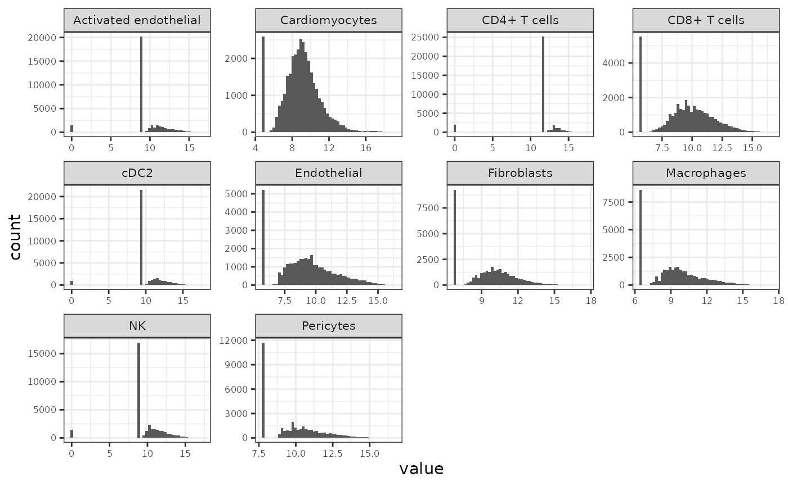
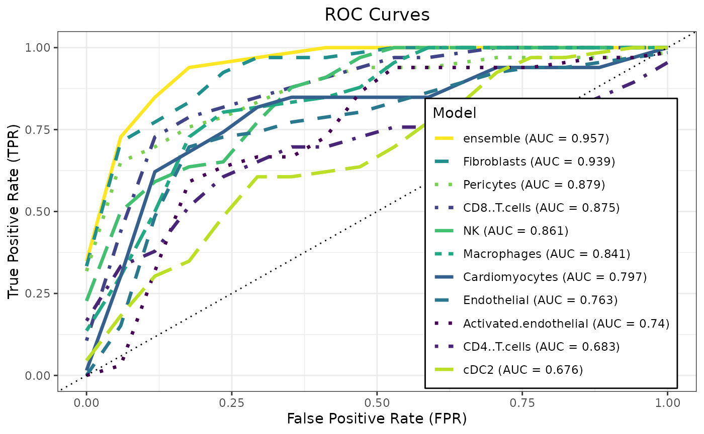
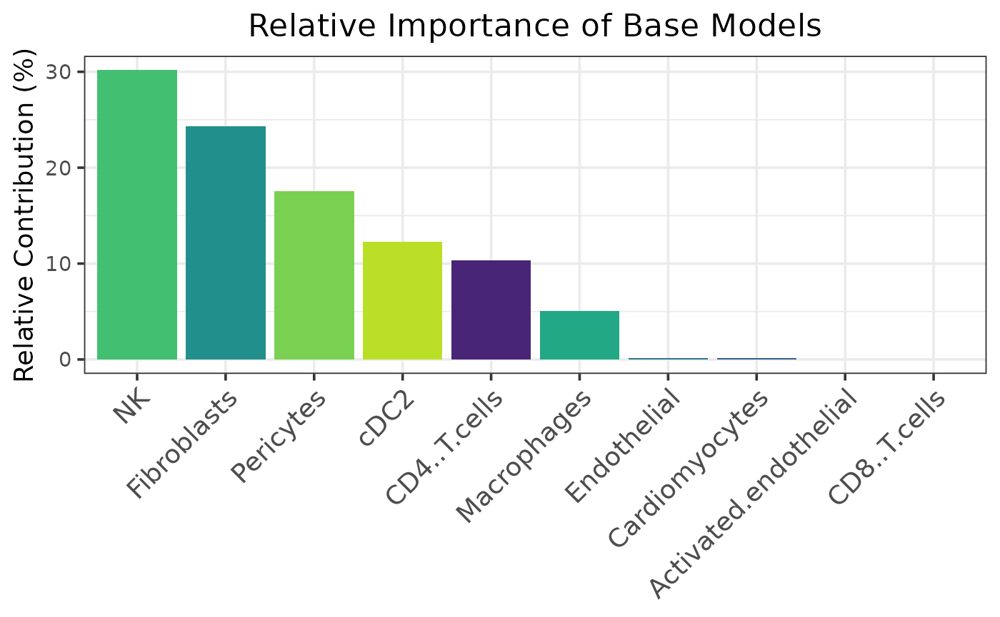
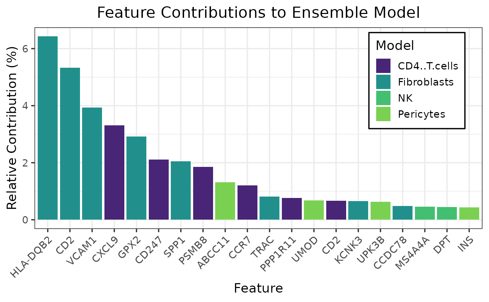

# Spatial Transcriptomics Heart Transplant Rejection Modeling

This vignette demonstrates a preprocessing workflow for deriving
multimodal sample-level views from spatial single-cell transcriptomics
data and using them with `caretMultimodal`.

Starting from Xenium heart transplant biopsy data from GEO (GSE290577),
we aggregate single-cell expression into pseudobulk profiles stratified
by cell type and sample, normalize each view independently, and assemble
the result into a MultiAssayExperiment suitable for multimodal modeling.
The resulting object can be used directly with caretMultimodal to train
modality-specific learners and stacked ensembles. For simplicity, the
modeling example shown here focuses on a binary classification task
comparing ellular versus antibody mediated rejection.

## Load and Preprocess the data

#### Collect the data from GEO

``` r

# Load the xenium data (takes a minute or two)
xenium_url <- "https://ftp.ncbi.nlm.nih.gov/geo/series/GSE290nnn/GSE290577/suppl/GSE290577_heart_spatial.rds"
xenium_raw <- curl::curl_fetch_memory(xenium_url)$content
xenium_obj <- unserialize(xenium_raw)
print(xenium_obj)
```

    ## Loading required namespace: SeuratObject

    ## An object of class Seurat 
    ## 477 features across 162638 samples within 1 assay 
    ## Active assay: RNA (477 features, 477 variable features)
    ##  3 layers present: counts, data, scale.data
    ##  3 dimensional reductions calculated: SP, pca, umap
    ##  1 spatial field of view present: fov

``` r

# Load the metadata
meta_url <- "https://ftp.ncbi.nlm.nih.gov/geo/series/GSE290nnn/GSE290577/suppl/GSE290577_heart_spatial_metadata.txt.gz"
meta_raw <- curl::curl_fetch_memory(meta_url)$content
meta_df <- read.delim(
    text = rawToChar(memDecompress(meta_raw, type = "gzip")),
    sep = "\t",
    header = TRUE,
    stringsAsFactors = FALSE
  )
# Restrict to pre-biopsy, non-mixed rejection samples
meta_df <- meta_df |>
  dplyr::filter(biopsy_timing == "pre") |>
  dplyr::filter(biopsy_rejection_type != "mixed_rejection") |>
  dplyr::arrange(patient_id)

head(meta_df)
```

    ##   patient_id       Sample biopsy_timing age_at_biopsy
    ## 1 Patient_10 Patient_10_1           pre            42
    ## 2 Patient_11 Patient_11_1           pre            55
    ## 3 Patient_11 Patient_11_2           pre            55
    ## 4 Patient_12 Patient_12_1           pre            58
    ## 5 Patient_12 Patient_12_2           pre            58
    ## 6 Patient_13 Patient_13_1           pre            60
    ##                               treatment cav_grade death
    ## 1                         oral_steroids         0     0
    ## 2 methylpred, thymoglobulin, PLEX, IVIG         1     1
    ## 3 methylpred, thymoglobulin, PLEX, IVIG         1     1
    ## 4                                  none         0     0
    ## 5                                  none         0     0
    ## 6                         oral_steroids         0     0
    ##   patient_cellular_grading patient_antibody_grading patient_rejection_type
    ## 1                        2                  pAMR1-h     cellular_rejection
    ## 2                        2                  pAMR1-h     cellular_rejection
    ## 3                        2                  pAMR1-h     cellular_rejection
    ## 4                        1                    pAMR2     antibody_rejection
    ## 5                        1                    pAMR2     antibody_rejection
    ## 6                        2                    pAMR0     cellular_rejection
    ##   biopsy_cellular_grading biopsy_antibody_grading biopsy_rejection_type sex
    ## 1                       2                  pAMR0     cellular_rejection   M
    ## 2                       1                pAMR1-h           no_rejection   M
    ## 3                       2                pAMR1-h     cellular_rejection   M
    ## 4                       0                pAMR1-i    antibody_rejection    M
    ## 5                       1                  pAMR2    antibody_rejection    M
    ## 6                       0                  pAMR0           no_rejection   M
    ##   race donor_age donor_sex transplant_age transplant_day
    ## 1    B        NA      <NA>       41.96851              0
    ## 2    W        26      Male       54.55715              0
    ## 3    W        26      Male       54.55715              0
    ## 4    W        28      Male       56.29295              0
    ## 5    W        28      Male       56.29295              0
    ## 6    W        31    Female       60.60507              0
    ##   days_from_transplant_to_biopsy days_from_transplant_to_cav
    ## 1                            245                        1861
    ## 2                            175                         267
    ## 3                            175                         267
    ## 4                           1059                        2129
    ## 5                           1059                        2129
    ## 6                             53                         355
    ##   days_from_transplant_to_death resolution_broad
    ## 1                            NA      persistence
    ## 2                           338         resolved
    ## 3                           338         resolved
    ## 4                            NA      persistence
    ## 5                            NA      persistence
    ## 6                            NA      persistence

#### Prepare cell-level metadata and count matrix

``` r

# Extract per-cell metadata and restrict to retained samples
cell_meta <- xenium_obj@meta.data |>
  dplyr::filter(Sample %in% meta_df$Sample)

# Standardize fields required by muscat
cell_meta <- cell_meta |>
  dplyr::mutate(
    response = biopsy_rejection_type,
    id = Sample,
    group = patient_id,
    sample_id = Sample,
    cluster_id = ct_second_pass
  )

# Extract raw counts (genes x cells), aligned to filtered metadata
rna_counts <- xenium_obj@assays$RNA@counts[, rownames(cell_meta), drop = FALSE]
```

#### Construct SingleCellExperiment

``` r

sce_rna <- SingleCellExperiment::SingleCellExperiment(
  assays = list(counts = rna_counts),
  colData = S4Vectors::DataFrame(cell_meta)
)
```

    ## Warning: replacing previous import 'S4Arrays::makeNindexFromArrayViewport' by
    ## 'DelayedArray::makeNindexFromArrayViewport' when loading 'SummarizedExperiment'

``` r

sce_rna
```

    ## class: SingleCellExperiment 
    ## dim: 477 68484 
    ## metadata(0):
    ## assays(1): counts
    ## rownames(477): ABCC11 ABHD16A ... XCR1 ZCCHC12
    ## rowData names(0):
    ## colnames(68484): aaadcmfp-1_1 aaaghlda-1_1 ... oimehgjn-1_2
    ##   oimeocni-1_2
    ## colData names(59): X orig.ident ... sample_id cluster_id
    ## reducedDimNames(0):
    ## mainExpName: NULL
    ## altExpNames(0):

#### Pseudobulk by cell type and sample with Muscat

``` r

pb_rna <- muscat::aggregateData(
  sce_rna,
  assay = "counts",
  fun = "sum",
  by = c("cluster_id", "sample_id")
)

pb_rna
```

    ## class: SingleCellExperiment 
    ## dim: 477 71 
    ## metadata(1): agg_pars
    ## assays(28): Activated endothelial Adipocytes ... Treg vSMCs
    ## rownames(477): ABCC11 ABHD16A ... XCR1 ZCCHC12
    ## rowData names(0):
    ## colnames(71): Patient_10_1 Patient_11_1 ... Patient_8_1 Patient_9_1
    ## colData names(31): orig.ident deprecated_codeword_counts ... id group
    ## reducedDimNames(0):
    ## mainExpName: NULL
    ## altExpNames(0):

#### Normalize pseudobulk assays (TMM + logCPM)

``` r

for (assay_name in SummarizedExperiment::assayNames(pb_rna)) {
  mat <- SummarizedExperiment::assay(pb_rna, assay_name)
  lib_size <- colSums(mat)

  keep_samples <- lib_size > 0

  norm_mat <- matrix(
    0,
    nrow = nrow(mat),
    ncol = ncol(mat),
    dimnames = dimnames(mat)
  )

  if (sum(keep_samples) >= 2) {
    dge <- edgeR::DGEList(counts = mat[, keep_samples, drop = FALSE])
    dge <- edgeR::calcNormFactors(dge, method = "TMM")

    norm_mat[, keep_samples] <- edgeR::cpm(
      dge,
      log = TRUE,
      prior.count = 0.5
    )
  }

  SummarizedExperiment::assay(pb_rna, paste0(assay_name, "_logCPM")) <- norm_mat
}
```

    ## calcNormFactors has been renamed to normLibSizes
    ## calcNormFactors has been renamed to normLibSizes
    ## calcNormFactors has been renamed to normLibSizes
    ## calcNormFactors has been renamed to normLibSizes
    ## calcNormFactors has been renamed to normLibSizes
    ## calcNormFactors has been renamed to normLibSizes
    ## calcNormFactors has been renamed to normLibSizes
    ## calcNormFactors has been renamed to normLibSizes
    ## calcNormFactors has been renamed to normLibSizes
    ## calcNormFactors has been renamed to normLibSizes
    ## calcNormFactors has been renamed to normLibSizes
    ## calcNormFactors has been renamed to normLibSizes
    ## calcNormFactors has been renamed to normLibSizes
    ## calcNormFactors has been renamed to normLibSizes
    ## calcNormFactors has been renamed to normLibSizes
    ## calcNormFactors has been renamed to normLibSizes
    ## calcNormFactors has been renamed to normLibSizes
    ## calcNormFactors has been renamed to normLibSizes
    ## calcNormFactors has been renamed to normLibSizes
    ## calcNormFactors has been renamed to normLibSizes
    ## calcNormFactors has been renamed to normLibSizes
    ## calcNormFactors has been renamed to normLibSizes
    ## calcNormFactors has been renamed to normLibSizes
    ## calcNormFactors has been renamed to normLibSizes
    ## calcNormFactors has been renamed to normLibSizes
    ## calcNormFactors has been renamed to normLibSizes
    ## calcNormFactors has been renamed to normLibSizes
    ## calcNormFactors has been renamed to normLibSizes

``` r

pb_rna_norm <- pb_rna
pb_rna_norm
```

    ## class: SingleCellExperiment 
    ## dim: 477 71 
    ## metadata(1): agg_pars
    ## assays(56): Activated endothelial Adipocytes ... Treg_logCPM
    ##   vSMCs_logCPM
    ## rownames(477): ABCC11 ABHD16A ... XCR1 ZCCHC12
    ## rowData names(0):
    ## colnames(71): Patient_10_1 Patient_11_1 ... Patient_8_1 Patient_9_1
    ## colData names(31): orig.ident deprecated_codeword_counts ... id group
    ## reducedDimNames(0):
    ## mainExpName: NULL
    ## altExpNames(0):

#### Convert to MultiAssayExperiment

``` r

# Identify normalized assays
log_assays <- grep("_logCPM$", SummarizedExperiment::assayNames(pb_rna_norm), value = TRUE)

# Sample-level metadata
sample_meta <- as.data.frame(SummarizedExperiment::colData(pb_rna_norm))
rownames(sample_meta) <- colnames(pb_rna_norm)
sample_meta <- S4Vectors::DataFrame(sample_meta)

# Build one SummarizedExperiment per cell type
se_list <- lapply(log_assays, function(assay_name) {
  mat <- SummarizedExperiment::assay(pb_rna_norm, assay_name)

  keep_genes <- matrixStats::rowVars(mat, na.rm = TRUE)
  keep_genes <- is.finite(keep_genes) & keep_genes > 0
  mat <- mat[keep_genes, , drop = FALSE]

  SummarizedExperiment::SummarizedExperiment(
    assays = list(logCPM = mat),
    colData = sample_meta[colnames(mat), , drop = FALSE]
  )
})

names(se_list) <- sub("_logCPM$", "", log_assays)

# Map assay columns to primary sample IDs
sample_map <- do.call(rbind, lapply(names(se_list), function(exp_name) {
  sample_ids <- colnames(se_list[[exp_name]])

  data.frame(
    assay = exp_name,
    primary = sample_ids,
    colname = sample_ids,
    stringsAsFactors = FALSE
  )
}))

# Construct MAE
mae_pb <- MultiAssayExperiment::MultiAssayExperiment(
  experiments = MultiAssayExperiment::ExperimentList(se_list),
  colData = sample_meta,
  sampleMap = sample_map
)
```

    ## Warning: sampleMap[['assay']] coerced with as.factor()

``` r

mae_pb
```

    ## A MultiAssayExperiment object of 28 listed
    ##  experiments with user-defined names and respective classes.
    ##  Containing an ExperimentList class object of length 28:
    ##  [1] Activated endothelial: SummarizedExperiment with 477 rows and 71 columns
    ##  [2] Adipocytes: SummarizedExperiment with 477 rows and 71 columns
    ##  [3] B cells: SummarizedExperiment with 477 rows and 71 columns
    ##  [4] BMX+ Activated endothelial: SummarizedExperiment with 477 rows and 71 columns
    ##  [5] Cardiomyocytes: SummarizedExperiment with 477 rows and 71 columns
    ##  [6] CD4+ T cells: SummarizedExperiment with 477 rows and 71 columns
    ##  [7] CD8+ T cells: SummarizedExperiment with 477 rows and 71 columns
    ##  [8] cDC1: SummarizedExperiment with 477 rows and 71 columns
    ##  [9] cDC2: SummarizedExperiment with 477 rows and 71 columns
    ##  [10] Endothelial: SummarizedExperiment with 477 rows and 71 columns
    ##  [11] Fibroblasts: SummarizedExperiment with 477 rows and 71 columns
    ##  [12] Lymphatic endothelial: SummarizedExperiment with 477 rows and 71 columns
    ##  [13] Macrophages: SummarizedExperiment with 477 rows and 71 columns
    ##  [14] Mast: SummarizedExperiment with 477 rows and 71 columns
    ##  [15] mDC: SummarizedExperiment with 477 rows and 71 columns
    ##  [16] Myofibroblasts: SummarizedExperiment with 477 rows and 71 columns
    ##  [17] NK: SummarizedExperiment with 477 rows and 71 columns
    ##  [18] pDC: SummarizedExperiment with 477 rows and 71 columns
    ##  [19] Pericytes: SummarizedExperiment with 477 rows and 71 columns
    ##  [20] Plasma: SummarizedExperiment with 477 rows and 71 columns
    ##  [21] POSTN+ Fibroblasts: SummarizedExperiment with 477 rows and 71 columns
    ##  [22] Proliferating DCs: SummarizedExperiment with 477 rows and 71 columns
    ##  [23] Proliferating endothelial: SummarizedExperiment with 477 rows and 71 columns
    ##  [24] Proliferating pericytes: SummarizedExperiment with 477 rows and 71 columns
    ##  [25] Proliferating T cells: SummarizedExperiment with 477 rows and 71 columns
    ##  [26] SPP1+ Macrophages: SummarizedExperiment with 477 rows and 71 columns
    ##  [27] Treg: SummarizedExperiment with 477 rows and 71 columns
    ##  [28] vSMCs: SummarizedExperiment with 477 rows and 71 columns
    ## Functionality:
    ##  experiments() - obtain the ExperimentList instance
    ##  colData() - the primary/phenotype DataFrame
    ##  sampleMap() - the sample coordination DataFrame
    ##  `$`, `[`, `[[` - extract colData columns, subset, or experiment
    ##  *Format() - convert into a long or wide DataFrame
    ##  assays() - convert ExperimentList to a SimpleList of matrices
    ##  exportClass() - save data to flat files

#### Summarize and filter low-coverage experiments

``` r

# Extract sample-level response labels from the MAE
response_vec <- SummarizedExperiment::colData(mae_pb)$response
names(response_vec) <- rownames(SummarizedExperiment::colData(mae_pb))
response_levels <- sort(unique(as.character(response_vec)))

# Minimum number of nonzero samples required per response group
min_samples <- 15

# Count nonzero-library samples in each response group for every assay
experiment_summary <- lapply(names(MultiAssayExperiment::experiments(mae_pb)), function(exp_name) {
  se <- MultiAssayExperiment::experiments(mae_pb)[[exp_name]]
  lib_size <- colSums(SummarizedExperiment::assay(se, "logCPM"))

  nonzero_samples <- names(lib_size)[lib_size > 0]
  nonzero_tab <- table(factor(response_vec[nonzero_samples], levels = response_levels))

  data.frame(
    experiment = exp_name,
    response = response_levels,
    n_nonzero_lib = as.integer(nonzero_tab),
    stringsAsFactors = FALSE
  )
}) |>
  dplyr::bind_rows()

# Retain assays with at least min_samples nonzero samples in every response group
keep_names <- experiment_summary |>
  dplyr::group_by(experiment) |>
  dplyr::summarise(keep = all(n_nonzero_lib >= min_samples), .groups = "drop") |>
  dplyr::filter(keep) |>
  dplyr::pull(experiment)

# Subset the MAE to retained assays
mae_pb_keep <- mae_pb[, , keep_names]
```

    ## Warning: 'experiments' dropped; see 'drops()'

    ## harmonizing input:
    ##   removing 1278 sampleMap rows not in names(experiments)

``` r

mae_pb_keep
```

    ## A MultiAssayExperiment object of 10 listed
    ##  experiments with user-defined names and respective classes.
    ##  Containing an ExperimentList class object of length 10:
    ##  [1] Activated endothelial: SummarizedExperiment with 477 rows and 71 columns
    ##  [2] CD4+ T cells: SummarizedExperiment with 477 rows and 71 columns
    ##  [3] CD8+ T cells: SummarizedExperiment with 477 rows and 71 columns
    ##  [4] Cardiomyocytes: SummarizedExperiment with 477 rows and 71 columns
    ##  [5] Endothelial: SummarizedExperiment with 477 rows and 71 columns
    ##  [6] Fibroblasts: SummarizedExperiment with 477 rows and 71 columns
    ##  [7] Macrophages: SummarizedExperiment with 477 rows and 71 columns
    ##  [8] NK: SummarizedExperiment with 477 rows and 71 columns
    ##  [9] Pericytes: SummarizedExperiment with 477 rows and 71 columns
    ##  [10] cDC2: SummarizedExperiment with 477 rows and 71 columns
    ## Functionality:
    ##  experiments() - obtain the ExperimentList instance
    ##  colData() - the primary/phenotype DataFrame
    ##  sampleMap() - the sample coordination DataFrame
    ##  `$`, `[`, `[[` - extract colData columns, subset, or experiment
    ##  *Format() - convert into a long or wide DataFrame
    ##  assays() - convert ExperimentList to a SimpleList of matrices
    ##  exportClass() - save data to flat files

#### Visualize per-assay logCPM distributions

``` r

plot_df <- lapply(names(MultiAssayExperiment::experiments(mae_pb_keep)), function(exp_name) {
  mat <- SummarizedExperiment::assay(
    MultiAssayExperiment::experiments(mae_pb_keep)[[exp_name]],
    "logCPM"
  )

  data.frame(
    value = as.vector(mat),
    experiment = exp_name
  )
}) |>
  dplyr::bind_rows()

ggplot2::ggplot(plot_df, ggplot2::aes(x = value)) +
  ggplot2::geom_histogram(bins = 50) +
  ggplot2::facet_wrap(~ experiment, scales = "free") +
  ggplot2::theme_bw() +
  ggplot2::theme(
    strip.text = ggplot2::element_text(size = 8),
    axis.text = ggplot2::element_text(size = 6)
  )
```



## Train models with caretMultimodal

There are several ways to model this data. For simplicity, this example
uses a binary classification task comparing cellular versus antibody
mediated rejection (ignoring subjects with no rejection).

``` r

set.seed(42L)

data_list <- caretMultimodal::prepare_mae(mae_pb_keep, transpose = TRUE)

# caretMultimodal currently expects syntactically safe view names
view_labels <- names(data_list)
view_names <- make.names(view_labels, unique = TRUE)
names(data_list) <- view_names

# Restrict to AMR vs CMR samples
responses <- factor(trimws(SummarizedExperiment::colData(mae_pb_keep)$response))
keep <- responses %in% c("antibody_rejection", "cellular_rejection")

data_list <- lapply(data_list, function(x) x[keep, , drop = FALSE])
response_subset <- droplevels(responses[keep])

# Elastic net hyperparameter grid
tuneGrid <- expand.grid(
  alpha = seq(0, 1, by = 0.1),
  lambda = 10^seq(-4, 1, length.out = 50)
)

# Repeated cross-validation
trControl <- caret::trainControl(
  method = "repeatedcv",
  number = 5,
  repeats = 5,
  savePredictions = "final",
  classProbs = TRUE,
  summaryFunction = caret::twoClassSummary
)

# Train base models
htr_models <- caretMultimodal::caret_list(
  target = response_subset,
  data_list = data_list,
  method = "glmnet",
  tuneGrid = tuneGrid,
  trControl = trControl
)
```

    ## Loading required package: ggplot2

    ## Loading required package: lattice

``` r

# Train stacked ensemble
htr_stack <- caretMultimodal::caret_stack(
  caret_list = htr_models,
  method = "glmnet",
  tuneGrid = tuneGrid,
  trControl = trControl
)
```

## Evaluate Models

``` r

summary(htr_stack)
```

    ##                     model method alpha      lambda       ROC       Sens
    ##                    <char> <char> <num>       <num>     <num>      <num>
    ##  1: Activated.endothelial glmnet   1.0 0.091029818 0.7518651 0.10000000
    ##  2:          CD4..T.cells glmnet   0.1 0.471486636 0.6954762 0.02666667
    ##  3:          CD8..T.cells glmnet   0.2 0.115139540 0.8928571 0.57000000
    ##  4:        Cardiomyocytes glmnet   0.2 0.022229965 0.7935714 0.47666667
    ##  5:           Endothelial glmnet   0.1 0.044984327 0.7536508 0.38000000
    ##  6:           Fibroblasts glmnet   1.0 0.056898660 0.9411111 0.69666667
    ##  7:           Macrophages glmnet   0.4 0.091029818 0.8729365 0.51000000
    ##  8:                    NK glmnet   0.1 0.022229965 0.8470635 0.24333333
    ##  9:             Pericytes glmnet   0.1 0.056898660 0.8860317 0.56666667
    ## 10:                  cDC2 glmnet   0.1 0.115139540 0.7025397 0.24666667
    ## 11:              ensemble glmnet   0.7 0.008685114 0.9786508 0.77333333
    ##          Spec      ROCSD    SensSD     SpecSD
    ##         <num>      <num>     <num>      <num>
    ##  1: 0.9647619 0.17297273 0.1666667 0.07626484
    ##  2: 0.9485714 0.20247181 0.1333333 0.12308242
    ##  3: 0.9285714 0.11595973 0.2147350 0.09597926
    ##  4: 0.8657143 0.14389650 0.1976716 0.17682746
    ##  5: 0.8857143 0.15262705 0.2558121 0.11884904
    ##  6: 0.9457143 0.08514564 0.2280655 0.08488354
    ##  7: 0.8923810 0.12570203 0.2693012 0.14171501
    ##  8: 0.9933333 0.13691066 0.2688711 0.03333333
    ##  9: 0.9247619 0.13006387 0.3071298 0.09365752
    ## 10: 0.9409524 0.16178537 0.2470661 0.11085287
    ## 11: 0.9323810 0.03880173 0.2435748 0.09187515

``` r

caretMultimodal::plot_roc(htr_stack)
```



``` r

caretMultimodal::plot_model_contributions(htr_stack)
```



``` r

caretMultimodal::plot_feature_contributions(htr_stack)
```


